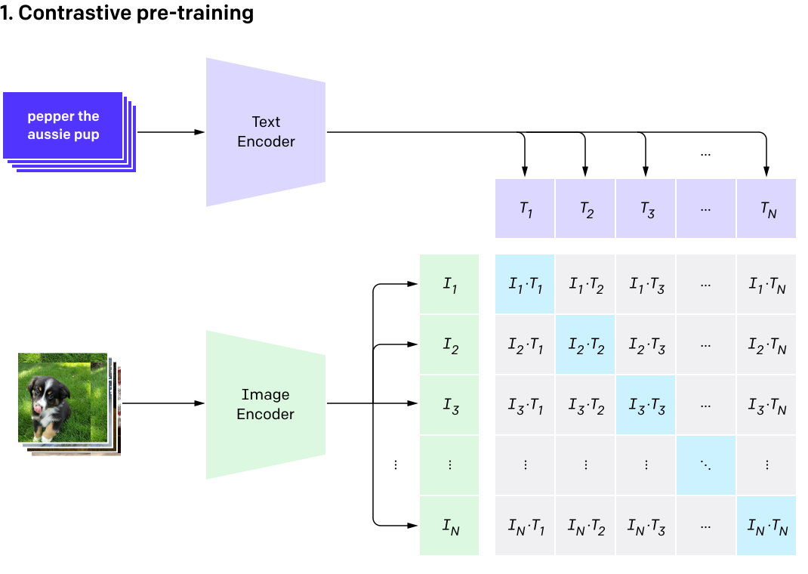

```{r setup, include=FALSE}
knitr::opts_chunk$set(echo = FALSE, message = FALSE, warning = FALSE)
library(igraph)
library(networkD3)
library(kableExtra)
library(formattable)
library(dplyr)
library(ggplot2)
library(hrbrthemes)
library(tidyr)
library(viridis)
library(plotly)

source(file = "graphics.R")
```


### Introduction


The robustness and high-level expression performed by neurons in the human brain are still unclear today. Consequently, the field of Neuroscience is still far from understanding how the brain operates and solves complex tasks such as differentiating classic rock from classical music or recognizing a visual representation of a person or object, all of which take only a fraction of a second. Nonetheless, research has shown ways to infer how the brain produces this output by examining patterns of neural activity recorded from the brain. These modes are used for many cognitive tasks, including processing images. On this topic, @Quiroga_2005 studied the neural activity of a group of neurons found in the human medial temporal lobe and found a breakthrough discovery of multimodal neurons. Specifically, the study showed how a group of different people, environments, or objects presented through photographs, artwork, and textual representations selectively activate a group of neurons in the medial temporal lobe. This examination revealed an example of neural multimodal information integration.


Multimodal integration refers to the neural integration of information from different sensory modalities. Studies have shown that this multimodal perception is widely related to the midbrain and the cerebral cortex. Hence, these areas carry neurons that respond to stimuli from multiple sensory modalities. For example, the superior temporal sulcus area of the brain contains neurons that respond to the visual and auditory elements of speech [@Calvert_2001]. This multisensory convergence zone acts as a neural intersection of information from different senses, where they are processed together. 


Similar to the brain, multimodal neurons exist in the recent CLIP models, as reported in @Goh_2021. This includes artificial neurons selecting prominent public figures or fictional characters, responding to the same subject in photographs, drawings, and images of their name. Consequently, the following essay provides an overall summary of my findings of the existence of multimodal neurons found in artificial neural networks. I start with summarizing the background of the research on such multimodal neurons found in recent CLIP (*Contrastive Language-Image Pre-training*) models. I then propose new ideas around the topic, highlighting my personal interest and ideas for next steps in research and application. 


```{r, out.width="100%", fig.align='center'}
# create a dataset:
data <- data.frame(
  from=c("A", "A", "B", "D", "C", "D", "E", "B", "C", "D", "K", "A", "M"),
  to=c("B", "E", "F", "A", "C", "A", "B", "Z", "A", "C", "A", "B", "K")
)

# Plot
p <- simpleNetwork(data, height="100px", width="100px")

```


\ 

### Background


CLIP (*Contrastive Language-Image Pre-training*) is a part of a set of papers that recently re-examined visual learning representations from natural language supervision. Hence, the CLIP model is an artificial neural network that uses natural language to suggest the most appropriate text for a given image. Naturally, CLIP consists of two main parts, a ResNet visual model and a Transformer language model. As shown in @Radford_2021, the CLIP model trains image and language encoders to predict the correct pairing of images and text in datasets from the internet. More specifically, given a set of $N$ image and text pairs, the CLIP model is trained to predict which of the $N \times N$ possible pairs actually occur. To do this, CLIP learns a multimodal embedding space by jointly training an image and text encoder to maximize the cosine similarity of the $N$ correct pairings while minimizing the $N^2 - N$ incorrect pairings. Then, in the testing process, the trained text encoder integrates a zero-sample linear classifier by inserting the label of each target class into the data set. 


As the name suggests, the CLIP model uses contrastive objectives to learn image representations from text elements. Calculated by comparing two or more data points, the contrastive loss method distinguishes images by similarity. Research has shown that contrastive objectives learn better and higher-quality image representations than other predictive objectives [@Tian_2020]. Correspondingly, @Radford_2021 found that substituting the predictive objectives with the contrastive objectives of CLIP increases the efficiency of the zero-sample transmission rate by four times. Zero-shot learning refers to the study of generalizing to unseen datasets in image classification; hence, it's training the model to classify data based on very few or no labeled examples. Consequently, @Radford_2021 promote zero-shot learning as an agent for performing unobserved tasks. To perform zero-shot classification, they reused model capabilities. So, for each dataset, the study uses the names of each class as the set of possible text pairings and then predicts the most probable image and text pair according to CLIP. In other words, the CLIP model learns from natural language to predict the most relevant text segment given an image.


Learning from natural language about images presents numerous advantages over other unsupervised or self-supervised learning methods. For example, natural language training methods passively learn from the supervision incorporated in the endless number of texts on the web. In addition, natural language learning methods learn a representation and then further connect the representation to the language, thereby achieving adaptable zero-sample transfer. Correspondingly, pre-training CLIP involved predicting the text caption that matched an image on a dataset of more than 400 million text and image pairs gathered from the internet [@Radford_2021]. After pre-training, the model uses the natural language to reference learned or new visual ideas, enabling the zero-shot transfer to downstream tasks. In summary, the CLIP model's ability to perform zero-shot classification means that it can be trained with natural language to classify images into new categories without providing labeled examples or fitting a model.


```{r}
library(captioner)
fig <- captioner::captioner(prefix = "Figure")
cap1 <- fig("cap1", "General approach of a CLIP model, consisting of a ResNet visual and Transformer language model.")
```

```{r, figures-side, fig.show="hold", out.width="50%", fig.cap=cap1}

knitr::include_graphics("static/overview-b.svg")
```


\ 


Recall that CLIP contains two main parts, a visual side and a language side. For the following, we focus on the visual side: the ResNet-based contrastive CLIP model designed as an image encoder. ResNet-$n$ is a convolutional neural network that is $n$ layers deep and usually trained on millions of images from ImageNet. ImageNet is a database that organizes images into categories according to the WordNet hierarchy. So generally, ImageNet provides formless labels to trained neural networks in classifying images; though, WordNet gives them a rich structure of higher-level nodes. For example, a trained network might classify a collection of images into categories such as different breeds of dogs, all of which are canines, which are mammals, which are animals. 


The ability of a ResNet model to classify representations from ImageNet is a result of its underlying deep learning algorithm, the convolutional neural network (CNN). CNN decomposes general image recognition tasks into a series of smaller tasks performed by subsequent layers, each of which deals with increasingly complex features. By definition, convolution is an orderly process in which multiple sources of information fuse, converting the initial input into a coherent form. Ultimately, the convolutional layers transform an image representation into numerical values, allowing the neural network to interpret and extract appropriate patterns. Specifically, the last convolutional layer discards the spatial information, reducing the input to a single vector, which is used to perform a dot product with language insertion to create a logit.


Across the board, each layer of the CNN consists of thousands of neurons. The @Goh_2021 study explicitly examined the neurons found in the last convolutional layer of the ResNet CLIP model and arranged them into neuron-like families, as shown in the following table. These neurons can select a distinct object and fire for associated stimuli. For example, there might be a "Beyonce neuron" that fires for Jay-Z or a "morning neuron" firing for images of coffee. The study also showed that these neurons tend to be inhibited by what might be considered the opposite stimulus. 

\ 


```{r, fig.align='center'}
df1
```


\ 

Each neuron contains a pre-labeled *feature visualization*, derived from the stimulus that activates the neuron. Feature visualization is an approach to make the learning characteristics of a neural network explicit, providing distinctive insight into the complex inner workings of the model. Executing feature visualization involves optimizing the input to the neural network to create behavioral stimuli that maximize the activation of a neuron. Hence, it requires finding the input that maximizes a neuron's activation. To do this, researchers use the logit calculated from the last convolutional layer: where both the vision and language sides meet with transformed numeric values to perform a dot product to create a logit. Logits, also known as log-odds, measure an input's probability to belong to a given category. The logit has the following bi-linear form [@Goh_2021] for some matrix $\mathbf{A}$, 


$$
\begin{align}
\mathrm{logit} & \equiv \frac{x_{\text{img}}^T \, \mathbf{A} \, x_{\text{text}}}{\| x_{\text{img}}\| \| x_{\text{text}} \|},
\end{align} 
$$


where $x_{\text{img}}$ is a vector of neurons in the second to last layer of the network, and $x_{\text{text}}$ is the embedded text. There are several interpretations of this logit term. For example, if we fix $x_{\text{text}}$, the term $Wx_{\text{text}}$ supplies a dynamic weight vector for classifying images. In other words, we can use text to automatically generate dynamic, zero-shot weight vectors for images. On the other hand, if we fix $x_{\text{img}}$, the term $x^T_{\text{img}}$ will provide weights based on how the text features correspond to the given image. Hence, if we fix a neuron on the visual side, we can search for text that maximizes the logit.


Generally speaking, neural network models are distinguishable in terms of their given input information. These input vectors propagate through each layer of the neural network, activating a set of specific neurons to varying degrees. To maximize this extent, we must know what type of input causes a neuron's maximal firing response. Feature visualization is a technique in which the information fed to the neural network is optimized to create stimuli that exhibit certain behaviors, usually maximizing the activation of neurons. So, to further understand what drives a particular cognitive behavior, one can iteratively adjust an input until it maximizes a neuron's firing response. 


----------------------------------------------------


### Idea Proposal 


Although feature visualization is a powerful tool in understanding what a neural network is naturally looking for, if we want to understand the complete behavior of a neuron, it's not enough to look at the cases where it maximally fires. We should look at the full spectrum: the instances where it weakly fired, border-line fired, and strongly deterred from firing. In contrast, feature visualization leverages optimization techniques intended to iteratively adjust the input until it maximizes a neuron's firing response. Hence, this optimization usually returns only an extreme example, only showing us one "facet" of what a feature represents in a neuron. 

Hence, feature visualization presents a small set of super-stimuli that's not necessarily representative of a neuron's complete behavior. Current research shows that different programs and tools can further promote the understanding of neuronal behavior in neural networks. One such method is to simply look at the original data set and possibly extract different sample points. For example, referring to the ImageNet set used to train the model, we can look across the full range of activations and thus provide more diverse cases sampled from the distribution of stimuli. 


Correspondingly, @Cammarata_2020 demonstrates a tool for plotting estimated conditional probabilities of several categories at different neuron activation levels to provide further insight into a neuron. To do this, it's necessary first to define buckets between the maximal inhibitory and excitation activation values, followed by explicitly sampling a fixed number of images for each bucket. Next, a selected person must manually label each image into several categories without having any information on the neuron's activations. As shown below, because activations have an arbitrary scale, the resulting conditional probability plots the activation axis in terms of standard deviations of activation from zero. 


```{r, out.width="100%", out.height="100%"}
thm2 <- theme_ipsum() + theme(text = element_text(size = 12, family = "Roboto"), legend.position = "none", plot.caption = element_text(size = 10), legend.text = element_text(size = 8), legend.title = element_text(color = "white", size = 1), axis.text.x = element_text(size = 10, family = "Roboto Condensed"), axis.text.y = element_text(size = 10, family = "Roboto Condensed"), axis.title.x = element_text(size = 12, colour = "#252525"), axis.title.y = element_text(size = 12))

g2 <- ggplot(diamonds, aes(carat, after_stat(count), fill = cut)) +
  geom_density(position = "fill") +
  scale_fill_manual(values = c("#365947", "#708B49", "#FDD87E", "#E67C49", "#E47E9B")) +
  ylab(label = "") + xlab(label = "Standard Deviations from Zero Activation") +
  thm2

m <- list(
  l = 5,
  r = 5,
  b = 20,
  t = 20,
  pad = 4
)

p <- ggplotly(g2) %>% layout(autosize = TRUE,  margin=m, height=336)
p

```


In short, a neural network (such as the CLIP model) contains a layer of neurons that are equivalent to neurons in the human brain. Nodes are connected to nodes in different layers through a series of mathematical weights, similar to synapses between neurons. Hence, in the quest to make neural networks interpretable, feature visualization represents a promising research approach. However, feature visualization will never present an adequate understanding by itself. Instead, researchers see it as a basic building block that, when combined with other tools, will promote human understanding of such systems.


----------------------------------------------


### Conclusion 


The CLIP model represents a bridge between computer vision and natural language processing, presenting an exceptional innovative technique that promotes significant additional innovation. With that said, the CLIP model is a preliminary product intended to illustrate challenges that general purpose computer vision models pose, giving a glimpse into their biases and impacts. As stated by OpenAI, the intended use of the model is a "research output for research communities" to better understand and explore zero-shot image classification, robustness, generalization, and other capabilities, biases, and constraints of computer vision models.


The CLIP model has a wide range of capabilities due to its ability to carry out arbitrary image classification tasks. A simple use case task is giving the model images of lions and tigers and asking it to classify lions. Or, one could tell the model to find images of Mars in a database by simply just giving it the keyword "Mars". Oppositely, one could give the model an image of Mars and ask it to find corresponding text. Hence, such tasks build on the idea that neural networks are growing more multimodal by learning concepts in several modalities. 

In hindsight, the study of multimodal neurons in artificial neural networks aligns with my growing personal interest in the interaction between artificial intelligence (AI) and neuroscience. With the ability of AI to identify patterns in extensive data sets, it's incredibly fascinating to see its applications to cognitive sciences, in part by imitating how the brain performs certain computations. Thus, artificial neural networks such as CLIP play a huge role in studying the brain. The idea is that a neural network system designed to behave similarly to the brain can inform ideas about how the brain solves cognitive tasks. For example, @Savage_2019 presented a deep neural network designed to replicate a brain's "retinotopic, hierarchical architecture" and then trained it with thousands of different images to conduct object classification. Consequently, the learning network produced several feasible patterns of neural activity, and the researchers compared these patterns with the patterns of neurons in the brain that perform similar cognitive recognition tasks. In the end, this study showed that the network with the most similar neural activity pattern to the brain performs best in object recognition.

In other words, if such a system can produce a pattern of neural activity resembling that of a brain, scientists can make inferences for how the brain operates by learning how the system generates its output. Hence, creating an artificial network to perform a particular cognitive task allows scientists to explain how the brain achieves the same thing. What's more, the artificial neural network allows people to easily control and study its deep and complex internal operation. We can communicate with almost all the weights in the network, apply gradients to optimize the input, and check billions of activations in the data. Hence, crafting these tools enable experiments that show us additional perspectives on neurons and their behaviors. 


-------------------------------------------


\newpage


### References


